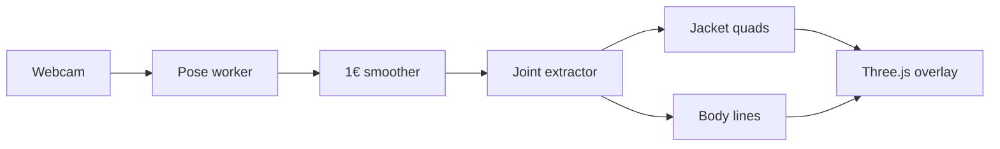

# Virtual try-on

A jacket that follows you. Open the demo, stand in frame, and a rendered jacket sits on your shoulders, torso, and sleeves — live, in the browser.

Your camera image stays on this computer. Body tracking runs locally. The first start downloads the pose model once; after that, frames never leave the page.

  

## Try it

You need [Node.js 20.19+](https://nodejs.org/) (or 22.12+) and a webcam.

```bash
npm install
npm run dev
```

Open [http://localhost:5173](http://localhost:5173).

1. **Preview jacket** shows the garment on a fixed standing pose, with the camera off.
2. **Start camera** asks for the webcam, loads the pose model, and dresses you.
3. **Show body lines** draws the tracked shoulders, arms, and hips over the video.

Stand back until your head, shoulders, and hips are in frame. Turn slowly and the sleeves follow. Allow the camera in the browser bar if the page says permission was blocked. The page has to be served over `localhost` or HTTPS for the camera to open.

## How a frame becomes a jacket



1. The page captures a user-facing camera stream at 1280×720 when the device allows it.
2. A web worker downscales each frame to 640px wide and runs [MediaPipe Pose Landmarker](https://ai.google.dev/edge/mediapipe/solutions/vision/pose_landmarker) (`pose_landmarker_full`). It tries the GPU delegate, then the CPU delegate.
3. A [1€ filter](https://gery.casiez.net/1euro/) smooths landmarks: steady when you hold still, quick when you move.
4. Image landmarks place the body on the video. World landmarks supply bone directions, so sleeves aim with the arms.
5. A jacket drawn on a canvas is stretched across the shoulders, hips, upper arms, and forearms. The neck opening stays clear so your face shows through.
6. Three.js composites that mesh on a transparent canvas over the video, in an orthographic view matched to the camera aspect.

Tracking hides the jacket when shoulders or hips drop out of view, and brings it back when they return.

## Layout

| Path | What it is |
| --- | --- |
| `apps/demo` | Vite page: camera, preview, status, and frame rate |
| `packages/engine` | `@vto/engine` — tracking, rig, and the jacket overlay |
| `scripts/build-jacket.mjs` | Builds a skinned `jacket.glb` the avatar loader can wear |

`@vto/engine` is the reusable piece. The demo is a thin page around it.

## Use the engine

```ts
import { VtoEngine } from "@vto/engine";

const engine = new VtoEngine({
  canvas, // transparent overlay
  video,  // the playing <video>
  onReady: (delegate) => {
    // "GPU" or "CPU" — whichever the pose model started on
  },
  onTracking: (visible) => {
    // false until shoulders and hips are in frame
  },
  onStats: ({ renderFps, poseFps }) => {
    // sampled about twice a second
  },
  onError: (message) => {
    // model download or worker failure
  },
});

engine.setShowSkeleton(true);
engine.startPreview();          // standing pose, no camera
await engine.start();           // live tracking
engine.setViewport(cssWidth, cssHeight, videoWidth / videoHeight);
engine.stop();
engine.dispose();
```

Wire the camera yourself with `navigator.mediaDevices.getUserMedia`, assign `video.srcObject`, and call `engine.start()` after `video.play()`. `apps/demo/src/main.ts` is the full version of that wiring, including permission errors and resize.

## Scripts

| Command | What it does |
| --- | --- |
| `npm run dev` | Starts the demo on port 5173 |
| `npm run typecheck` | Type-checks the engine and the demo |
| `npm run build -w @vto/demo` | Type-checks and builds the demo with Vite |
| `node scripts/build-jacket.mjs` | Writes `apps/demo/public/garments/jacket.glb` |

The live demo wears the canvas jacket inside the engine. The GLB script is for the skinned mesh path: a wool jacket with torso, sleeves, collar, and cuffs, plus fit measurements the avatar expects (`shoulderWidth`, `torsoLength`, `upperArmLength`, `forearmLength`).

## Privacy

- The webcam stream is read in the page and posted to a worker as an `ImageBitmap`. It is not uploaded.
- The pose model and its WASM runtime are fetched on first start from Google’s model host and jsDelivr, then used locally.
- Stopping the camera ends the media tracks.
